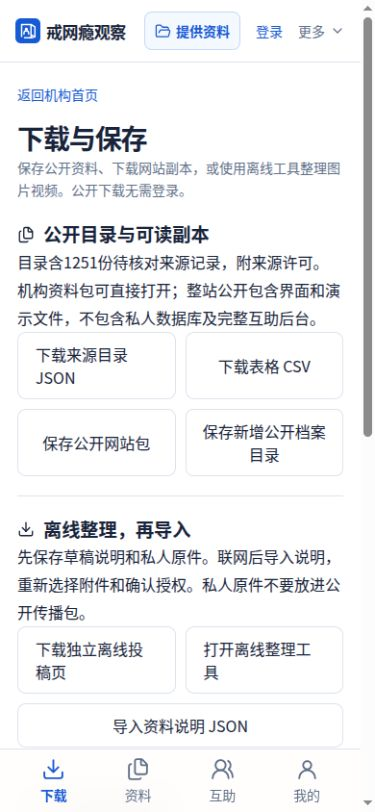

# 戒网瘾机构观察

**面向手机的机构来源档案、资料保存与经历互助项目。** 关注中国大陆的戒网瘾、特训与封闭矫正相关机构，让公开资料便于查找、理解、下载和接力维护。

这是可运行的试用项目，保留来源、核对状态和公开范围。目录收录不意味着已经认定机构违法，也不意味着机构仍在经营。项目不接受收费推广。

[查看网站](https://kanjian-archive-concept.chengbiliu3.chatgpt.site/) · [详细项目说明](docs/project-guide.md) · [下载与复制](docs/download-and-deploy.md) · [参与贡献](CONTRIBUTING.md) · [资料查找交接](docs/research-handoff.txt)

## 不懂代码，也能使用

1. 打开网站，直接以游客查找机构、地区和公开资料。
2. 点击“下载”，保存来源表格、JSON目录或公开网站包。
3. 点击“提供资料”，整理线索与图片视频；提交后保存私人回执。
4. 需要互助发帖、回复时，再通过“登录”进入账号。当前身份入口依赖ChatGPT托管平台。
5. 想把公开站复制给别人，可从 [Releases](https://github.com/linyoulinhai/jiewangyin-observer/releases) 下载公开包；完整代码也能通过绿色 **Code → Download ZIP** 下载。

**最简单的复制方式是下载公开网站包。** 源码 ZIP 是开发项目，和能直接展示的公开网站包用途不同。

## 当前提供什么

- **机构展示**：机构首页、全国地区示意地图、省市筛选、名称与别名搜索、来源档案页。
- **公开资料**：1251份待核对来源记录，保留来源编号、粗粒度地区、出处和许可说明；这不是1251家已核实独立机构。
- **资料收件**：私人草稿、明确提交、私人回执、人工审核、选择公开附件、撤回与独立更正队列。
- **经历互助**：登录发帖回复、公开昵称、公约、频率限制、首帖及争议内容审核、处理说明和申诉。
- **保存传播**：JSON、CSV、静态网站ZIP、获准传播的单帖导出、离线整理页与PWA公开界面缓存。
- **媒体处理**：浏览器本地文件按字节分包、SHA256核验与还原。**尚未实现可独立播放的视频切段与合成，也不自动上传到网盘。**
- **维护备份**：管理员加密导出数据库与原件分卷，本地恢复工具；尚无线上一键灾备切换。
- **线索工具**：本地视频/评论JSON导入；可选抖音官方接口适配器只有模拟测试，B站自动采集尚未实现。

## 界面预览

顶部“登录／我的”紧邻“提供资料”；手机底部为下载、资料、互助、我的。点击站点标题返回机构首页。



## 运行开发版

需要 **Node.js 24、npm、Python 3**。

```sh
npm ci
npm run dev
```

打开终端显示的 `http://127.0.0.1:8770/`。本机用户和管理员入口仅供测试，不是生产认证。服务只监听本机；不应将该模拟身份服务器暴露到公网。

```sh
npm test
node scripts/check-concept.cjs
python3 scripts/package-public.py
npm run build
```

`dist/client/` 是构建后的静态文件，`dist/server/index.js` 是Worker。GitHub副本不带原站的托管项目绑定，构建时提示未绑定Sites是正常的。完整论坛上线前必须配置自己的身份、D1、R2与可信入口，详见[部署说明](docs/download-and-deploy.md)。

## 文件在哪里

- `dist/`：公开前端、来源JSON/CSV、媒体示意素材、公开网站包、离线工具、第三方许可。
- `worker/`：互助、收件、公开档案、附件权限和审核API。
- `db/`、`drizzle/`：数据表和按顺序应用的迁移。
- `scripts/`、`tests/`：构建、公开打包、预览、本地恢复与权限测试。
- `tools/手机媒体分包工具/`：独立媒体分包工具及测试。
- `tools/线索收集工具/`：本地私人线索队列程序及虚构导入样例。
- `docs/`：项目说明、复制部署、资料核对流程与界面截图。

## 实际资料与权限

原始私人资料库、联系方式、负责人信息、精确地址、私人经历、账号数据、回执和真实上传原件均未上传到本仓库。后台代码及空表结构可以公开，运行中的私人数据库不公开。Github Issues和Pull Requests只用于代码及已可公开的问题，敏感线索请走网站私人收件。

目录参考 [NCT archive](https://github.com/goodpsychologistclaw/nct-archive) 与 [PanDefenseProject](https://github.com/FunctionSir/PanDefenseProject)。来源记录已做公开字段筛选，保留同名候选而非自动认定同一主体。原始媒体仅有链接时，不宣称已取得文件或授权。AI示意图和虚构经历另作演示标记。

## 当前限制与协作方向

尚需完成国内账号方案和真机可达性、真机大文件上传、可播放视频切段/合成、媒体使用核对、正式审核运营、独立镜像和线上恢复。当前后台全站附件额度为 **1GB试用参数**；GitHub不是实际投稿和视频原件存储后端。没有承诺零成本支持全国媒体规模。

欢迎通过Fork和PR改进手机操作、无障碍、搜索、文档与测试；也欢迎整理有出处的公开线索。新来源需要人工核对后公开，不把评论或搜索结果直接当作事实。详细步骤见[贡献说明](CONTRIBUTING.md)。

## 许可

本项目新编写代码和说明沿用 [MIT](LICENSE)。**第三方数据和媒体保留各自许可，不统一改成MIT。** PanDefense来源为AGPL-3.0，NCT archive标注Unlicense；Lucide图标为ISC；独立真实建筑照片按CC BY-SA 4.0署名。详见 [来源与第三方许可](docs/data-and-licenses.md) 和 `dist/` 内许可证。投稿者的个人经历、图片和视频需分别确认公开与传播范围。

版本：2026-10-09。此GitHub仓库是原站当前实现的可协作源码副本，原站仍由既有托管流程发布；推送GitHub不会自动替换原站。
